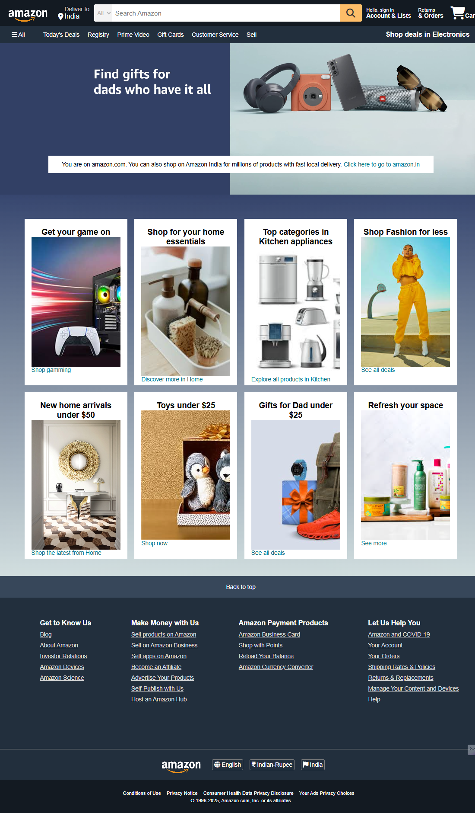

# amazon-clone-html-css

This is a simple **Amazon Clone** project built using only **HTML** and **CSS**.  
It is part of my frontend learning journey.

## Features

- Amazon-inspired header with logo, search bar, and navigation
- Responsive top navigation panel
- Hero section with promotional banner
- Product grid with different categories
- Footer with multiple useful links (similar to Amazon)
- Fully responsive layout using CSS Flexbox and media queries

## Technologies Used

- HTML5
- CSS3
- Font Awesome Icons

## Preview

  

## Project Status

✅ Basic Amazon UI Clone  
🚀 More features (JavaScript, interactivity) will be added later as I learn more.

## How to Use

1. Clone the repository or download the ZIP.
2. Open `index.html` in your browser.

## Acknowledgments

This project is inspired by Amazon’s homepage and was created for **educational purposes** only.

---

⭐ **Follow my GitHub for more projects!**  
Made with ❤️ by [Aneree Patel](https://github.com/Aneree05)
